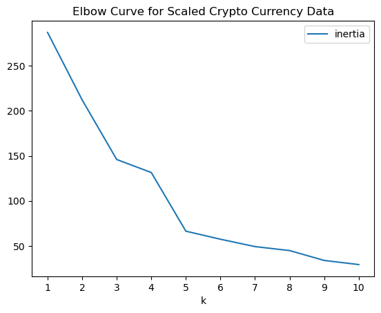
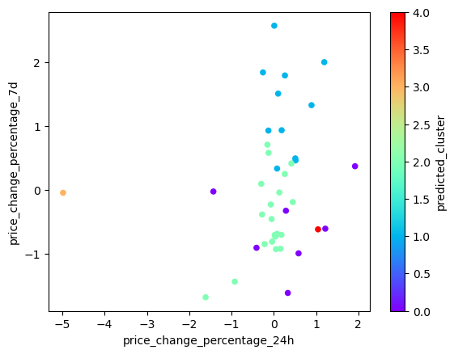
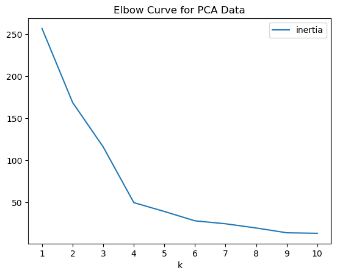
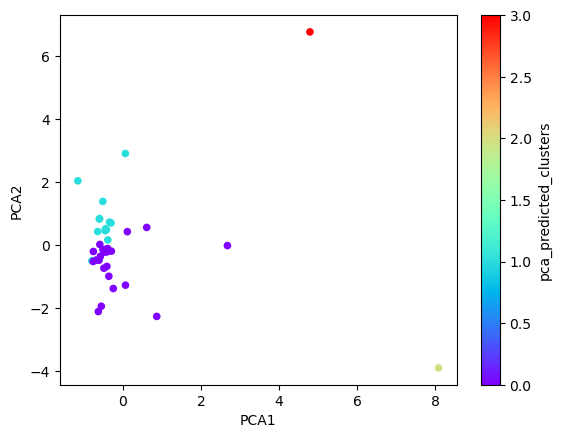

# Project to demonstrate Unsupervised Learning
## Clustering of Crypto Currency Data

The project demonstrates methods used for unsupervised learning and methods to use.

Libraries required
```python 
import pandas as pd
from sklearn.cluster import KMeans
from sklearn.decomposition import PCA
from sklearn.preprocessing import StandardScaler
```
The code imports an existing scaled dataset that is to be used for this project

At the outset, following code is used to arrive at the best value of k using the dataframe created. First a list range is defined for k and an empty list is created to store inertia values

```python
k = list(range(1,11))

# Create an empty list to store the inertia values
inertia = []
```

KMeans model is initiated from inside a for loop

```python
for i in k:
# Inside the loop:
    # 1. Create a KMeans model using the loop counter for the n_clusters
    k_model = KMeans(n_clusters=i, n_init = 'auto', random_state=1)
```

After the model is created, its used to fit the existing dataframe. The resultant values are stored in inertia.

```python
k_model.fit(crypto_scaled_df)
    # 3. Append the model.inertia_ to the inertia list
    inertia.append(k_model.inertia_)
```
In order to visually identify optimal k value, a line chart is plotted with all the inertia values computed with the different values of k



This curve show the optimal value is 5. Now the KMeans model is initialized using the optimal value for k and the model is fitted to scaled data that was sourced at the outset.

```python
crypto_model = KMeans(n_clusters=5, n_init='auto', random_state=1)

# Fit the K-Means model using the scaled data
crypto_model.fit(crypto_scaled_df)
```
Fitted model is used to predict optimal values

```python
# Predict the clusters to group the cryptocurrencies using the scaled data
crypto_predict = crypto_model.predict(crypto_scaled_df)

```
> array([1, 1, 2, 2, 1, 1, 1, 1, 1, 2, 0, 2, 2, 1, 2, 2, 2, 2, 1, 2, 0, 1,
       2, 2, 2, 2, 2, 0, 1, 2, 2, 2, 3, 2, 0, 0, 4, 0, 2, 2, 0])

To ensure integrity of the data, prediction result is added to the copy of the original dataframe
```python
crypto_predicted_df = crypto_scaled_df.copy()
# Add a new column to the DataFrame with the predicted clusters
crypto_predicted_df['predicted_cluster'] = crypto_predict
```
The new column is plotted using a scatter plot. The plot will look like below

```python
crypto_predicted_df.plot.scatter
(x = 'price_change_percentage_24h', 
y ='price_change_percentage_7d', 
c = 'predicted_cluster', 
colormap= 'rainbow'
)
```


The initial dataframe is fir and then transformed using using Principal Component Analysis. First a PCA model is initiated to reduce to (3) principal components
```python
# Create a PCA model instance and set `n_components=3`.
pca = PCA(n_components=3)

# Use the PCA model with `fit_transform` on the original scaled DataFrame to reduce to three principal components.
crypto_pca = pca.fit_transform(crypto_scaled_df)
```
The total explained variance of the three principal components is 89.5 based on following array values

> array([0.3719856 , 0.34700813, 0.17603793])

The transformed data is added to a new dataframe, Index of coid_id is added to this dataframe by taking from original dataframe

```python
# Creating a DataFrame with the PCA data
crypto_scaled_pca_df = pd.DataFrame(crypto_pca,columns=['PCA1', 'PCA2', 'PCA3'])

# Copy the crypto names from the original data

crypto_scaled_pca_df['coin_id'] = crypto_scaled_df.index

# Set the coin_id column as index
crypto_scaled_pca_df.set_index('coin_id', inplace=True)
```
The new dataframe looks like this
<div>
<style scoped>
    .dataframe tbody tr th:only-of-type {
        vertical-align: middle;
    }

    .dataframe tbody tr th {
        vertical-align: top;
    }

    .dataframe thead th {
        text-align: right;
    }
</style>
<table border="1" class="dataframe">
  <thead>
    <tr style="text-align: right;">
      <th></th>
      <th>PCA1</th>
      <th>PCA2</th>
      <th>PCA3</th>
    </tr>
    <tr>
      <th>coin_id</th>
      <th></th>
      <th></th>
      <th></th>
    </tr>
  </thead>
  <tbody>
    <tr>
      <th>bitcoin</th>
      <td>-0.600667</td>
      <td>0.842760</td>
      <td>0.461595</td>
    </tr>
    <tr>
      <th>ethereum</th>
      <td>-0.458261</td>
      <td>0.458466</td>
      <td>0.952877</td>
    </tr>
    <tr>
      <th>tether</th>
      <td>-0.433070</td>
      <td>-0.168126</td>
      <td>-0.641752</td>
    </tr>
    <tr>
      <th>ripple</th>
      <td>-0.471835</td>
      <td>-0.222660</td>
      <td>-0.479053</td>
    </tr>
    <tr>
      <th>bitcoin-cash</th>
      <td>-1.157800</td>
      <td>2.041209</td>
      <td>1.859715</td>
    </tr>
    <tr>
      <th>binancecoin</th>
      <td>-0.516534</td>
      <td>1.388377</td>
      <td>0.804071</td>
    </tr>
    <tr>
      <th>chainlink</th>
      <td>-0.450711</td>
      <td>0.517699</td>
      <td>2.846143</td>
    </tr>
    <tr>
      <th>cardano</th>
      <td>-0.345600</td>
      <td>0.729439</td>
      <td>1.478013</td>
    </tr>
    <tr>
      <th>litecoin</th>
      <td>-0.649468</td>
      <td>0.432165</td>
      <td>0.600303</td>
    </tr>
    <tr>
      <th>bitcoin-cash-sv</th>
      <td>-0.759014</td>
      <td>-0.201200</td>
      <td>-0.217653</td>
    </tr>
  </tbody>
</table>
</div>

Now that we have PCA transformed data, let us identify the best value of k using PCA data.

A new dataframe is created similar to the steps taken earlier in the code i.e.

1. Create a range for k
2. Initialize a list to capture inertial values
3. run range of k values using for loop
4. Create dictionary of k and inertial values
5. Populate the dataframe

Elbow curve is plotted for new dataframe



You can see that the optimal value in this curve is 4 compared 5 that was in the earlier plot

Using the PCA data, new dataframe is clustered with K-means and then fitted and predicted. Similar to the steps we did earlier, the prediction values are added to the dataframe. A new scatter plot is created to visualize the data



Now, we can determine the weights of each feature (column) on each Principal Component by transforming data to a new dataframe and using index from initial dataframe that was created with scaled data. The resultant dataframe 

<div>
<style scoped>
    .dataframe tbody tr th:only-of-type {
        vertical-align: middle;
    }

    .dataframe tbody tr th {
        vertical-align: top;
    }

    .dataframe thead th {
        text-align: center;
    }
</style>
<table border="1" class="dataframe">
  <thead>
    <tr style="text-align: right;">
      <th>coin_id</th>
      <th>PCA1</th>
      <th>PCA2</th>
      <th>PCA3</th>
    </tr>
  </thead>
  <tbody>
    <tr>
      <th>price_change_percentage_24h</th>
      <td>-0.416728</td>
      <td>0.358162</td>
      <td>-0.218795</td>
    </tr>
    <tr>
      <th>price_change_percentage_7d</th>
      <td>-0.102432</td>
      <td>0.227432</td>
      <td>0.787670</td>
    </tr>
    <tr>
      <th>price_change_percentage_14d</th>
      <td>-0.009162</td>
      <td>0.540415</td>
      <td>0.349534</td>
    </tr>
    <tr>
      <th>price_change_percentage_30d</th>
      <td>0.191523</td>
      <td>0.562182</td>
      <td>-0.181744</td>
    </tr>
    <tr>
      <th>price_change_percentage_60d</th>
      <td>0.320365</td>
      <td>0.434040</td>
      <td>-0.361377</td>
    </tr>
    <tr>
      <th>price_change_percentage_200d</th>
      <td>0.594468</td>
      <td>0.027735</td>
      <td>0.039733</td>
    </tr>
    <tr>
      <th>price_change_percentage_1y</th>
      <td>0.568379</td>
      <td>-0.150789</td>
      <td>0.210541</td>
    </tr>
  </tbody>
</table>
</div>

From this table, we can analyze that certain features have positive influence while few have negative influence

### Positive influences

1. 'price_change_percentage_200d' and 'price_change_percentage_1y' have the strongest positive influence on PCA1. 
2. 'price_change_percentage_30d' and 'price_change_percentage_14d' have the strongest positive influence on PCA2.
3. 'price_change_percentage_7d' has the strong positive influence on overall.

### Negative influence

1. 'price_change_percentage_24h' have the strongest overall negative influence, followed by 'price_change_percentage_60d'


